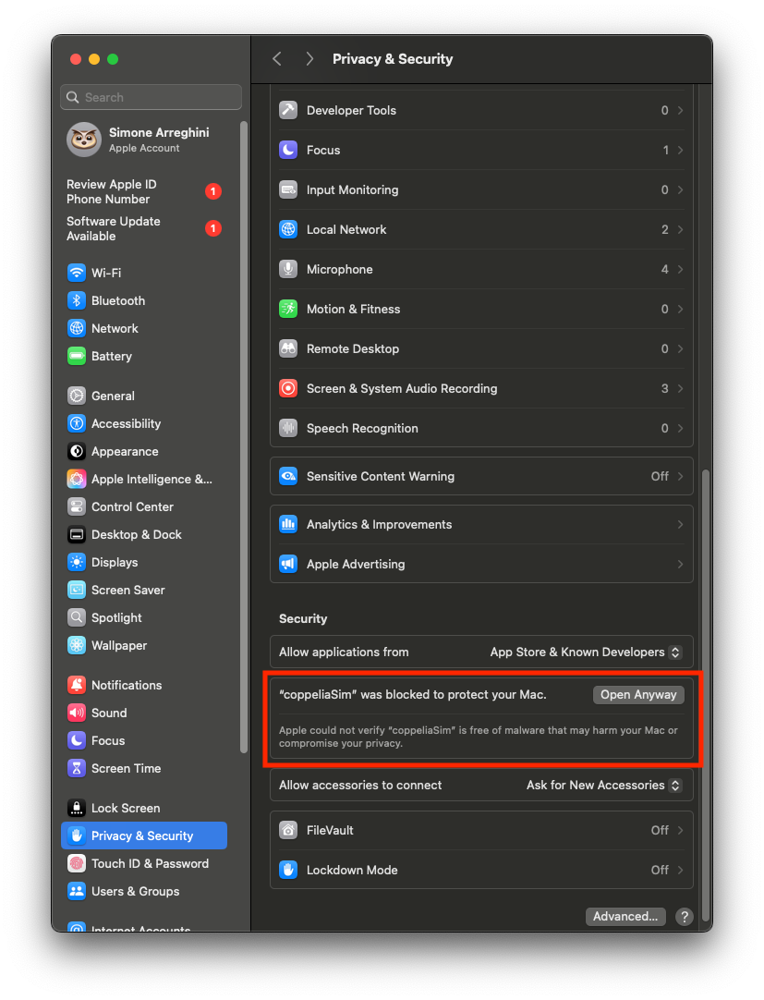

# RoboMaster Installation Guide

This guide provides step-by-step instructions for installing the RoboMaster Simulation running in CoppeliaSim using Pixi.

---

## 🧩 Install CoppeliaSim

### macOS

1. Download CoppeliaSim for [Apple Silicon](https://downloads.coppeliarobotics.com/V4_7_0_rev4/CoppeliaSim_Edu_V4_7_0_rev4_macOS14_arm64.zip) or [Intel](https://downloads.coppeliarobotics.com/V4_7_0_rev4/CoppeliaSim_Edu_V4_7_0_rev4_macOS13_x86_64.zip)
2. Unzip and move to `/Applications/coppeliaSim.app`
3. Right-click on `coppeliaSim.app` -> Open -> Open
4. Add the following to the `pixi.toml` in your pixi project:
   ```toml
   [activation.env]
   COPPELIASIM_ROOT_DIR = "/Applications/coppeliaSim.app/Contents/Resources"
   ```
5. CoppeliaSim must be launched from the Terminal (this will become important later):
   ```bash
   /Applications/coppeliaSim.app/Contents/MacOS/coppeliaSim
   ```

#### Troubleshooting

- If you encounter any permission errors, please authorize coppeliaSim in the System Settings:
  

### Ubuntu

1. Download CoppeliaSim for [Ubuntu 22.04](https://downloads.coppeliarobotics.com/V4_7_0_rev4/CoppeliaSim_Edu_V4_7_0_rev4_Ubuntu22_04.tar.xz) or [Ubuntu 24.04](https://downloads.coppeliarobotics.com/V4_7_0_rev4/CoppeliaSim_Edu_V4_7_0_rev4_Ubuntu24_04.tar.xz)
2. Extract CoppeliaSim in a directory of your choice, for example in your `COURSE_FOLDER`:
   ```bash
   cd <COURSE_FOLDER>
   tar xvf CoppeliaSim_Edu_V4_7_0_rev4_Ubuntu<UBUNTU_VERSION>.tar.xz
   ```
3. Add to `pixi.toml`:
   ```toml
   [activation.env]
   COPPELIASIM_ROOT_DIR = "<PATH_TO_COPPELIA>/CoppeliaSim_Edu_V4_7_0_rev4_Ubuntu<UBUNTU_VERSION>"
   ```
4. CoppeliaSim must be launched from the Terminal (this will become important later):
   ```bash
   <PATH_TO_COPPELIA>/CoppeliaSim_Edu_V4_7_0_rev4_Ubuntu<UBUNTU_VERSION>/coppeliaSim.sh
   ```

---

## 🤖 RoboMaster setup

We prepared a Pixi project for you with all required dependencies for using the RoboMaster in CoppeliaSim. You can set it up by cloning this repository:

```bash
git clone git@github.com:idsia-robotics/robotics-lab-usi-robomaster.git --recursive
```

**Ubuntu:** You need to customize the `COPPELIASIM_ROOT_DIR` in the `pixi.toml` of this repo to point to your CoppeliaSim installation.

Now enter the repository, compile and install the packages:

```bash
cd robotics-lab-usi-robomaster
pixi install
pixi shell
colcon build --symlink-install
```

You can launch CoppeliaSim with this command. This is important to ensure that Coppelia is started with the correct environment variables to see the ROS packages installed in this repo:

```bash
source install/setup.zsh
pixi run coppelia
```

## ✅ Test your installation

1. Open CoppeliaSim.
2. Add a RoboMaster to the scene via: `Model browser (the left sidebar) -> robots -> mobile -> RoboMasterEP`
3. Press play and ensure no errors are printed in the Coppelia log (Bottom).

With CoppeliaSim running and a Robomaster in the scene, run:

```bash
cd src/robomaster_sim/examples
pixi shell
python discover.py
```
This script should find the RoboMaster in the scene, print some info about it, and close itself.

#### Troubleshooting
- **macOS 15:** This macOS update introduced stricter controls on local network access, which the RoboMaster ROS driver needs to communicate with the RoboMaster model in Coppelia. If communication fail with `ERROR conn.py:107 scan_robot_ip: exception timed out`, please check that your terminal app (e.g. Terminal, iTerm, Visual Studio Code) is authorized to access the local network. Go in System Settings.app -> Privacy & Security -> Local Network and add / enable your terminal app.

## 🚀 Run

You're ready to start using your simulated RoboMaster. While the simulation is running as described in the previous step, launch the RoboMaster ROS driver:

```bash
source install/setup.zsh
ros2 launch robomaster_ros ep.launch
```

In another terminal, inside the `<ROS_PROJECT_FOLDER>`.

```bash
pixi shell
ros2 topic pub /cmd_vel geometry_msgs/msg/Twist "{linear: {x: 0.0, y: 0.0, z: 0.0}, angular: {x: 0.0, y: 0.0, z: 0.5}}"
```

The robot should start to rotate counter-clockwise.

Use this command to stop it:

```bash
ros2 topic pub /cmd_vel geometry_msgs/msg/Twist "{linear: {x: 0.0, y: 0.0, z: 0.0}, angular: {x: 0.0, y: 0.0, z: 0.0}}"

---

Your installation is complete! 🎉
